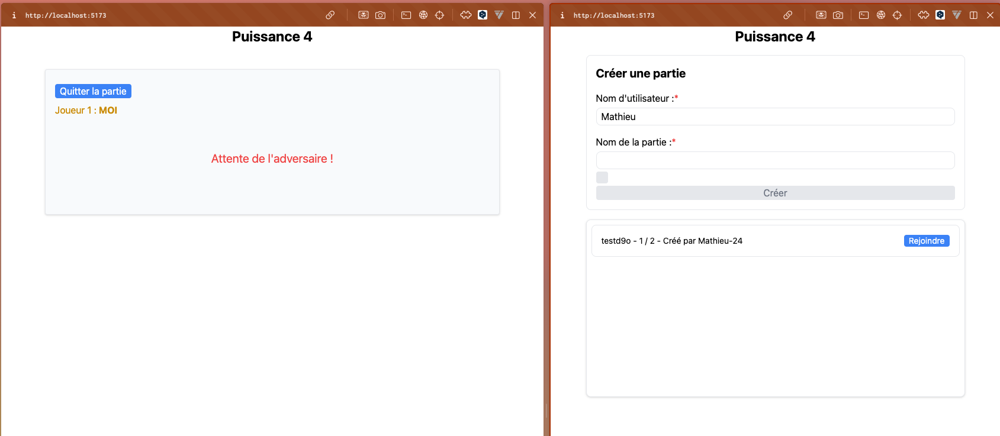
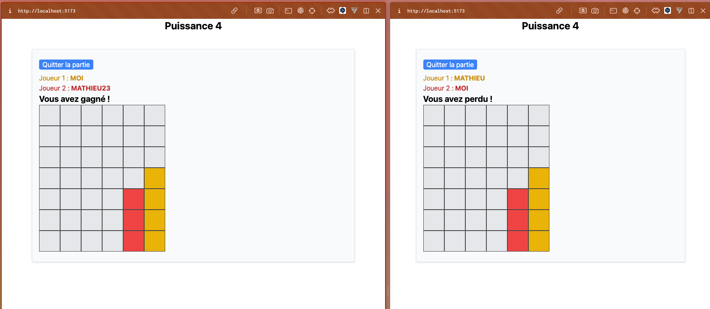

# Jeu de Puissance 4

## Sommaire
- [Présentation](#présentation)
- [Objectif](#objectif)
- [Installation](#installation)
- [Demo](#demo)

## Présentation

- Un jeu de puissance 4 multijoueur
- Un serveur WebSocket
- design simple

## Objectif
- Pratiquer les websockets
- Pratiquer les composants Vue
- Pratiquer les hooks Vue
- Pratiquer express

# Installation

## Cloner le projet

```bash
    git clone https://github.com/mathieuprog/power-4-socket-vue.git
    cd power-4-socket-vue
```

## Frontend

```bash
    cd pwer-4
    npm install
    npm run dev
```

## Backend

```bash
    cd pwer-4-back
    npm install
    npm run dev
```

# Demo

